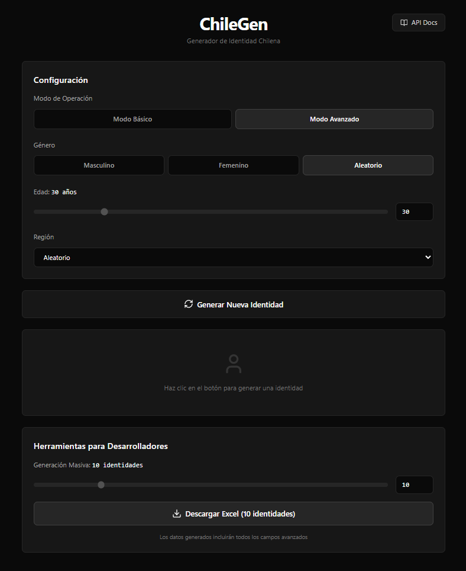

# 🇨🇱 ChileGen - Generador de Identidad Chilena

   

**ChileGen** es una herramienta moderna y gratuita diseñada para desarrolladores y QAs que necesitan generar datos de prueba realistas para el contexto chileno. Ofrece una interfaz web intuitiva y una API pública robusta.

🔗 **Sitio Web:** [https://chilegen.cl](https://chilegen.cl)
📚 **Documentación API:** [https://chilegen.cl/api-docs](https://chilegen.cl/api-docs)



---

## ✨ Características Principales

### 👤 Identidad y Datos Personales
* **RUT Válido:** Generación de RUTs reales con algoritmo Módulo 11.
* **Coherencia:** El RUT generado corresponde al rango etario seleccionado.
* **Nombres Reales:** Base de datos de nombres y apellidos comunes en Chile.

### 🏦 Datos Financieros y Avanzados
* **Lógica Bancaria Real:**
    * Si el banco es *BancoEstado* y la cuenta es *CuentaRUT*, el número de cuenta coincide con el RUT (sin dígito verificador).
* **Tarjetas de Crédito:** Generación de números válidos (Visa/Mastercard) usando algoritmo de Luhn.
* **Salud:** Previsión (Fonasa/Isapre) y AFP aleatorias.
* **Ubicación:** Direcciones coherentes con comunas y regiones de Chile.

### 🛠️ Herramientas para Desarrolladores
* **Exportación Masiva:** Genera hasta 50 identidades y descárgalas en **Excel (.xlsx)**.
* **JSON Copy:** Copia la estructura de datos completa al portapapeles con un clic.
* **API Pública:** Endpoint REST gratuito con soporte CORS.

---

## 🚀 API Pública

ChileGen expone una API gratuita para integrar en tus aplicaciones.

**Endpoint:**
`GET https://chilegen.cl/api/random`

### Parámetros
| Parámetro | Tipo | Descripción | Default |
|-----------|------|-------------|---------|
| `mode` | string | `basic` o `advanced`. Advanced incluye bancos, salud, etc. | `basic` |
| `qty` | number | Cantidad de identidades (Max: 10). | `1` |

## Ejemplo de uso
```bash
curl "[https://chilegen.cl/api/random?mode=advanced&qty=2](https://chilegen.cl/api/random?mode=advanced&qty=2)"
```

## Seguridad
La API cuenta con Rate Limiting impulsado por Redis (Upstash) para prevenir abusos:

* Límite: 10 peticiones cada 10 segundos por IP.

---

## 💻 Instalación Local
Si deseas correr el proyecto en tu máquina:

1. Clonar el repositorio:

```bash
git clone [https://github.com/0xSS3K/Chile-gen-app.git](https://github.com/0xSS3K/Chile-gen-app.git)
cd Chile-gen-app
```
2. Instalar dependencias:
```bash
npm install
```
3. Configurar Variables de Entorno: Crea un archivo .env.local en la raíz y agrega tus credenciales de Upstash (necesarias para el Rate Limiting):

```Fragmento de código
UPSTASH_REDIS_REST_URL="tu_url_aqui"
UPSTASH_REDIS_REST_TOKEN="tu_token_aqui"
```

Iniciar el servidor de desarrollo:

```bash
npm run dev
```

## 🛠️ Tecnologías Utilizadas
* **Framework**: Next.js 14 (App Router)
* **Lenguaje**: TypeScript
* **Estilos**: Tailwind CSS
* **Iconos**: Lucide React
* **Exportación**: SheetJS (xlsx)
* **Database/Rate Limit**: Upstash Redis
* **Despliegue**: Vercel

---

### 📄 Licencia
Este proyecto está bajo la Licencia MIT - siéntete libre de usarlo para tus proyectos personales o comerciales.

Hecho con ❤️ en Chile 🇨🇱
